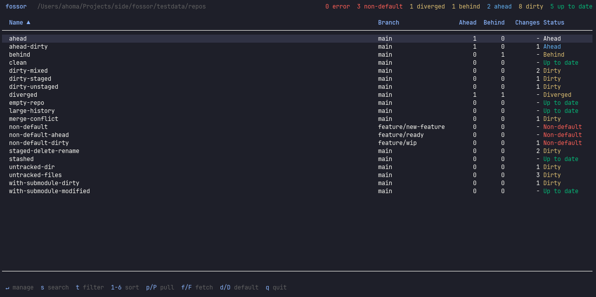

<p align="center">
  
</p>

<h1 align="center">Fossor</h1>
<p align="center"><strong>A terminal UI for managing multiple Git repositories from a single screen.
</strong></p>

<p align="center">
  <a href="https://github.com/yachiko/fossor/actions/workflows/ci.yml"></a>
  <a href="https://github.com/yachiko/fossor/releases"></a>
  <a href="LICENSE"></a>
  <a href="go.mod"></a>
</p>

--- 

Fossor discovers git repos in a directory, shows their consolidated status (branch, commits ahead/behind, uncommitted changes), and provides a unified manage view with git operations, diff viewer, commit history, stash management, and branch operations.

<p align="center">
  
</p>

## Features

- **Repository discovery** -- scans a directory for git repos with parallel fetching
- **Main screen** -- sortable, filterable table of all repos with live status counts
- **Manage view** -- four-tab workspace for individual repos:
  - **Status** -- file list with pretty diffs, staged/unstaged indicators, submodule detection, and a full action grid (pull, push, fetch, rebase, stash, commit, and more)
  - **History** -- scrollable commit log
  - **Stash** -- stash entries with diff preview, pop and drop
  - **Branches** -- branch table with ahead/behind indicators, merged status, switch/create/rename/delete
- **Interactive git commands** -- operations that need terminal access (commit editor, interactive rebase, merge conflicts) suspend the TUI and hand the terminal to git
- **Inline commit** -- write commit messages in-app with staged diff visible, or open `$EDITOR` for longer messages
- **Submodule support** -- detected and labeled in file list, submodule-aware diffs

## Install

```
go install github.com/yachiko/fossor@latest
```

Or build from source:

```
make build
```

## Usage

```
fossor [path] [flags]
```

**Arguments:**

- `path` -- directory containing git repos (default: current directory)

**Flags:**

- `-r, --recursive` -- recursively scan for git repositories
- `--no-fetch` -- skip git fetch during discovery
- `--no-auto-refresh` -- disable the periodic background refresh of the selected repo
- `--open-cmd <cmd>` -- command used to open the selected repo (e.g. `code`, `cursor`). When set, the `o` key on the main screen runs `<cmd> <repo-path>`. Falls back to `$FOSSOR_OPEN_CMD` if the flag is empty. Hidden from help when neither is set.

**Examples:**

```bash
# Scan current directory
fossor

# Scan a specific directory
fossor ~/projects

# Recursive scan without fetching
fossor ~/work -r --no-fetch
```

## Keyboard Shortcuts

### Main Screen

| Key       | Action                                    |
| --------- | ----------------------------------------- |
| `Enter`   | Open manage view                          |
| `s` / `/` | Search repos                              |
| `t`       | Cycle filter                              |
| `1-6`     | Sort by column                            |
| `p` / `P` | Pull selected / all                       |
| `f` / `F` | Fetch selected / all                      |
| `d` / `D` | Switch to default branch (selected / all) |
| `o`       | Open in external editor (requires `--open-cmd` / `$FOSSOR_OPEN_CMD`) |
| `j` / `k` | Move cursor down / up                     |
| `q`       | Quit                                      |

### Manage View -- Status Tab

| Key         | Action                         |
| ----------- | ------------------------------ |
| `Up/Down`   | Navigate file list             |
| `PgUp/PgDn` | Scroll diff                    |
| `p`         | Pull                           |
| `R`         | Pull --rebase                  |
| `u`         | Push                           |
| `f`         | Fetch                          |
| `d`         | Switch to default branch       |
| `s`         | Stash                          |
| `S`         | Stash pop                      |
| `a`         | Stage all                      |
| `i`         | Stage selected file            |
| `I`         | Unstage selected file          |
| `c`         | Commit (inline)                |
| `C`         | Commit (editor)                |
| `x`         | Restore selected file          |
| `X`         | Delete selected untracked file |
| `U`         | Submodule update --init        |
| `b`         | Rebase                         |
| `B`         | Rebase -i                      |
| `m`         | Merge                          |
| `z`         | Reset --soft HEAD~1            |
| `Z`         | Reset --hard HEAD~1            |
| `k`         | Cherry-pick                    |
| `Tab`       | Next tab                       |
| `1-4`       | Jump to tab                    |
| `Esc`       | Back to main screen            |

### Manage View -- History Tab

| Key         | Action            |
| ----------- | ----------------- |
| `Up/Down`   | Scroll commit log |
| `PgUp/PgDn` | Page scroll       |

### Manage View -- Stash Tab

| Key         | Action                 |
| ----------- | ---------------------- |
| `Up/Down`   | Navigate stash entries |
| `PgUp/PgDn` | Scroll stash diff      |
| `p`         | Pop selected stash     |
| `d`         | Drop selected stash    |

### Manage View -- Branches Tab

| Key           | Action               |
| ------------- | -------------------- |
| `Up/Down`     | Navigate branches    |
| `Enter` / `s` | Switch to branch     |
| `n`           | Create new branch    |
| `r`           | Rename branch        |
| `d`           | Delete branch (safe) |
| `D`           | Force delete branch  |

## Development

```bash
# Build
make build

# Run tests
make test

# All checks (vet + test + build)
make check

# Update dependencies
make update

# Create test repositories (20 repos with various states)
make testdata

# Reset test repos to initial state
make testdata-reset

# Clean build artifacts and test data
make clean
```

## Troubleshooting

If a stuck repo seems to keep appearing, set `FOSSOR_DEBUG=1` and re-run fossor.
Stale `.git/*.lock` files that fossor recovers are logged to
`~/.cache/fossor/debug.log` with the repo path, lock file, and the lock's age
at removal time. More in [docs/reference/troubleshooting.md](docs/reference/troubleshooting.md).

## Documentation

Full docs follow the [Diátaxis](https://diataxis.fr/) framework under [`docs/`](docs/index.md):

- **Tutorials** — [first-run walkthrough](docs/tutorials/first-run.md)
- **How-To** — [bulk operations](docs/how-to/bulk-operations.md), [stashes & branches](docs/how-to/manage-stashes-and-branches.md), [external editor](docs/how-to/open-in-editor.md)
- **Reference** — [keybindings](docs/reference/keybindings.md), [CLI flags](docs/reference/cli.md), [status states](docs/reference/status-states.md), [troubleshooting](docs/reference/troubleshooting.md)
- **Explanation** — [architecture](docs/explanation/architecture.md), [design choices](docs/explanation/design-choices.md)

See also [`CONTRIBUTING.md`](CONTRIBUTING.md), [`CHANGELOG.md`](CHANGELOG.md), and [`SECURITY.md`](SECURITY.md).

## Tech Stack

- [Go](https://go.dev/)
- [Bubble Tea](https://github.com/charmbracelet/bubbletea) -- TUI framework
- [Bubbles](https://github.com/charmbracelet/bubbles) -- TUI components
- [Lip Gloss](https://github.com/charmbracelet/lipgloss) -- Terminal styling
- [Cobra](https://github.com/spf13/cobra) -- CLI framework

## License

MIT
